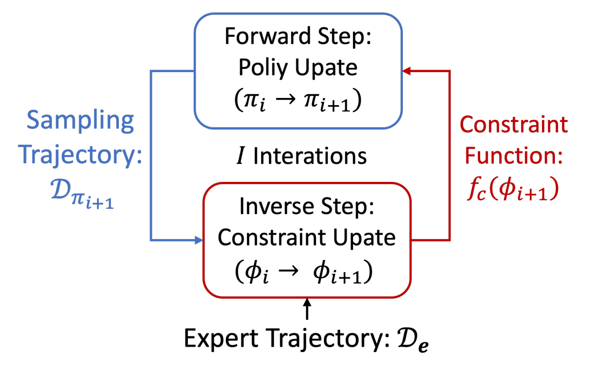

# Awesome-Constraint-Inference-in-RL

A collection of research papers on constraint inference within the field of Reinforcement Learning (RL), with a primary focus on **Inverse Constrained Reinforcement Learning (ICRL)**. And our survey paper *[A Comprehensive Survey on Inverse Constrained Reinforcement Learning: Definitions, Progress and Challenges](https://openreview.net/pdf?id=WUQsBiJqyP)* has been accepted to TMLR 2025.

This repository will be continuously updated. Welcome to follow and star it!

## Importance of Inferring Constraints

To ensure the reliability of a Reinforcement Learning (RL) algorithm within safety-critical applications, it is crucial for the agent to have knowledge of the underlying constraints. However, in many real-world tasks, the constraints are often unknown and difficult to specify mathematically, particularly when these constraints are time-varying, context-dependent, and inherent to the expert’s own experience. For example, the following figure shows a contemporary example of a highway merging task, where the ideal constraints depend on the traffic or road conditions as well as the weather. 

An example of the context-sensitive car distance constraint between vehicles during a merge on the highway. Under proper weather conditions, when vehicle speed is relatively low and traffic congestion is high, the distance between cars can be reduced. However, in adverse weather conditions, when vehicles are moving fast and traffic is sparse, it becomes necessary to increase the distance between cars to ensure safety.

## Procedure of ICRL

An effective approach to resolve the above challenges is Inverse Constrained Reinforcement Learning (ICRL), which infers the implicit constraints respected by expert agents, utilizing experience collected from both the environment and the observed demonstration dataset. These constraints learned through a data-driven approach, can effectively generalize across multiple environments, thereby providing a more comprehensive explanation of the expert agents’ behavior and facilitating safety control in downstream applications.

In typical preference modeling approach, the agent must first recover the rewards optimized and constraints respected by expert agents, and imitate experts by optimizing the Constrained Reinforcement Learning (CRL) objective under these constraints. This is a challenging task since there might be various equivalent combinations of reward distributions and constraints that can explain the same expert demonstrations. Striving for identifiability, ICRL algorithms simplify the problem by assuming that rewards are observable, and the goal is to recover only the constraints that best explain the expert data. The inference process of ICRL often involves alternating between updating an imitating policy and updating a constraint function. The following figure summarizes the main procedure of ICRL.

  

## Papers

### Constraint Inference in Inverse Optimal Control

- [Learning constraints from demonstrations](https://arxiv.org/pdf/1812.07084) [Workshop 2018]

  - Glen Chou, Dmitry Berenson, Necmiye Ozay
  - Addressed the forward problem with the hit-and-run sampling algorithm
  - ` General Constrains` `Discrete`

- [Learning parametric constraints in high dimensions from demonstrations](http://proceedings.mlr.press/v100/chou20a/chou20a.pdf) [CoRL 2019]

  - Glen Chou, Necmiye Ozay, Dmitry Berenson
  - Extended to continuous state spaces by employing parametric constraint functions
  - ` Parametric Constrains` `Continuous`

- [Uncertainty-aware constraint learning for adaptive safe motion planning from demonstrations](https://proceedings.mlr.press/v155/chou21a/chou21a.pdf) [CoRL 2020]

  - Glen Chou, Necmiye Ozay, Dmitry Berenson
  - Devised uncertainty-aware constraints driven by Bayesian inference
  - ` Uncertainty-aware Constrains` `Continuous`

- [Constraint inference in control tasks from expert demonstrations via inverse optimization](https://ieeexplore.ieee.org/stamp/stamp.jsp?arnumber=10383197) [CDC 2023]

  - Dimitris Papadimitriou, Jingqi Li
  - Proposed an incremental greedy constraint inference algorithm
  - `Constraint Set`

- [Efficient learning of constraints and generic null space policies](https://ieeexplore.ieee.org/stamp/stamp.jsp?arnumber=7989181) [ICRA 2017]

  - Leopoldo Armesto, Jorren Bosga, Vladimir Ivan, Sethu Vijayakumar
  - Focuses on learning geometric constraints
  - `Geometric Constraints`

- [C-learn: Learning geometric constraints from demonstrations for multi-step manipulation in shared autonomy](https://ieeexplore.ieee.org/stamp/stamp.jsp?arnumber=7989466) [ICRA 2017]

  - Leopoldo Armesto, Jorren Bosga, Vladimir Ivan, Sethu Vijayakumar
  - Learned multi-step manipulation tasks from demonstrations as a sequence of key frames and a set of geometric constraints
  - `Geometric Constraints`

- [Isoperimetric constraint inference for discrete-time nonlinear systems based on inverse optimal control](https://ieeexplore.ieee.org/stamp/stamp.jsp?arnumber=10471228) [IEEE Transactions on Cybernetics 2024]

  - Qinglai Wei, Tao Li, Jie Zhang, Hongyang Li, Xin Wang, Jun Xiao
  - Inferred the unknown isoperimetric constraints given optimal state and control trajectories
  - `Isoperimetric Constraints`

- [Learning object orientation constraints and guiding constraints for narrow passages from one demonstration](https://web.cs.wpi.edu/~rich/heres_how/pub/LiBerenson2016_ISER.pdf) [ISER 2016]

  - Changshuo Li, Dmitry Berenson
  - Explored the area around the demonstration trajectory through sampling in task space, and learned constraints by
    segmenting and analyzing the feasible samples
  - `Trajectory-oriented Constraints`

- [Inferring and assisting with constraints in shared autonomy](https://ieeexplore.ieee.org/stamp/stamp.jsp?arnumber=7799299) [CDC 2016]

  - Negar Mehr, Roberto Horowitz, Anca D. Dragan
  - Introduced a method for inferring constraints from operator input, along with a confidence-based way of assisting the user in maintaining them, and evaluate in a user study
  - `Trajectory-oriented Constraints`

### Constraint Inference from human interventions

- [Learning Constraints on Autonomous Behavior from Proactive Feedback](https://ieeexplore.ieee.org/stamp/stamp.jsp?arnumber=10341801) [IROS 2023]

  - Connor Basich, Saaduddin Mahmud, Shlomo Zilberstein
  - Assumed access only to sparse interventions, and inferred constraints from human interventions  without full or partial
    demonstration trajectories
  - `Constraint Set`

- [Expert intervention learning: An online framework for robot learning from explicit and implicit human feedback](https://personalrobotics.cs.washington.edu/publications/spencer2022eil.pdf) [Autonomous Robots 2022]

  - Jonathan Spencer, Sanjiban Choudhury, Matthew Barnes, Matthew Schmittle, Mung Chiang, Peter Ramadge, Sidd Srinivasa
  - Formalized interventions as action-value constraints
  - `Intervention Consrtaints`

### Inverse Constrained Reinforcement Learning

  Coming soon...